# Metodología de Implementación - Sistema de Detección de Exoplanetas

## 🏗️ Arquitectura General del Sistema

### Componentes Principales

```mermaid
graph TD
    A[Datos Raw - KOI/TOI/K2] --> B[Preprocesamiento]
    B --> C[Feature Engineering]
    C --> D[Ensemble Models]
    D --> E[Predicción & Evaluación]
    E --> F[API Backend]
    F --> G[Interfaz Web]
    
    D --> H[Model Training]
    D --> I[Hyperparameter Tuning]
    D --> J[Cross-Validation]
```



### Stack Tecnológico Recomendado

#### Backend & ML
- **Python 3.8+**: Lenguaje principal
- **scikit-learn**: Algoritmos de ML base
- **pandas**: Manipulación de datos
- **numpy**: Operaciones numéricas
- **TSFRESH**: Feature extraction para series temporales
- **LightGBM/XGBoost**: Gradient boosting algorithms
- **joblib**: Serialización de modelos

#### API & Web Framework
- **FastAPI**: API REST moderna y rápida
- **uvicorn**: Servidor ASGI
- **pydantic**: Validación de datos
- **SQLAlchemy**: ORM para base de datos (opcional)

#### Frontend
- **React.js**: Framework UI
- **D3.js/Chart.js**: Visualizaciones
- **Bootstrap/Tailwind CSS**: Styling
- **Axios**: HTTP client

#### Deployment
- **Docker**: Containerización
- **Nginx**: Proxy reverso
- **Gunicorn**: WSGI server para producción
- **Cloud platforms**: AWS/GCP/Azure

## 📊 Pipeline de Procesamiento de Datos

### Fase 1: Ingesta de Datos

#### Fuentes de Datos
```python
# Estructura de datasets
datasets = {
    'KOI': {
        'source': 'NASA Exoplanet Archive',
        'target_column': 'koi_disposition',
        'classes': ['CONFIRMED', 'CANDIDATE', 'FALSE POSITIVE']
    },
    'TOI': {
        'source': 'TESS',
        'target_column': 'tfopwg_disp',
        'classes': ['KP', 'PC', 'FP', 'APC']
    },
    'K2': {
        'source': 'K2 Mission',
        'target_column': 'k2_disp',
        'classes': ['CONFIRMED', 'CANDIDATE', 'FALSE POSITIVE']
    }
}
```

#### Lectura y Unificación
```python
import pandas as pd
from typing import Dict, List

class DataLoader:
    def __init__(self):
        self.label_mapping = {
            'CONFIRMED': 1, 'KP': 1,
            'CANDIDATE': 0, 'PC': 0, 'APC': 0,
            'FALSE POSITIVE': 0, 'FP': 0
        }
    
    def load_unified_dataset(self) -> pd.DataFrame:
        """Carga y unifica todos los datasets"""
        koi_data = self.load_koi()
        toi_data = self.load_toi()
        k2_data = self.load_k2()
        
        return self.merge_datasets([koi_data, toi_data, k2_data])
```

### Fase 2: Preprocesamiento

#### Limpieza de Datos
```python
class DataPreprocessor:
    def clean_data(self, df: pd.DataFrame) -> pd.DataFrame:
        """Limpieza básica de datos"""
        # Eliminar duplicados
        df = df.drop_duplicates()
        
        # Manejar valores faltantes
        df = self.handle_missing_values(df)
        
        # Filtrar outliers extremos
        df = self.filter_outliers(df)
        
        # Normalización de columnas
        df = self.normalize_columns(df)
        
        return df
    
    def handle_missing_values(self, df: pd.DataFrame) -> pd.DataFrame:
        """Estrategias específicas para valores faltantes"""
        # Parámetros estelares: imputación por mediana
        stellar_cols = ['koi_srad', 'koi_smass', 'koi_slogg']
        df[stellar_cols] = df[stellar_cols].fillna(df[stellar_cols].median())
        
        # Parámetros planetarios: imputación condicional
        planet_cols = ['koi_prad', 'koi_period', 'koi_impact']
        for col in planet_cols:
            df[col] = df.groupby('koi_disposition')[col].transform(
                lambda x: x.fillna(x.median())
            )
        
        return df
```

#### Normalización y Escalado
```python
from sklearn.preprocessing import StandardScaler, MinMaxScaler
from sklearn.compose import ColumnTransformer

class FeatureScaler:
    def __init__(self):
        self.scalers = {
            'standard': StandardScaler(),
            'minmax': MinMaxScaler(),
            'robust': RobustScaler()
        }
    
    def create_preprocessing_pipeline(self):
        """Pipeline de preprocesamiento"""
        numeric_features = ['koi_period', 'koi_prad', 'koi_teq', ...]
        categorical_features = ['koi_pdisposition', ...]
        
        preprocessor = ColumnTransformer(
            transformers=[
                ('num', StandardScaler(), numeric_features),
                ('cat', OneHotEncoder(drop='first'), categorical_features)
            ]
        )
        
        return preprocessor
```

### Fase 3: Feature Engineering

#### Extracción de Características Temporales
```python
from tsfresh import extract_features
from tsfresh.feature_extraction import ComprehensiveFCParameters

class FeatureEngineer:
    def __init__(self):
        self.fc_parameters = ComprehensiveFCParameters()
    
    def extract_lightcurve_features(self, timeseries_data):
        """Extrae 789 características usando TSFRESH"""
        features = extract_features(
            timeseries_data,
            column_id='star_id',
            column_sort='time',
            default_fc_parameters=self.fc_parameters
        )
        return features
    
    def create_custom_features(self, df: pd.DataFrame) -> pd.DataFrame:
        """Características específicas para exoplanetas"""
        # Razones y productos de parámetros
        df['planet_star_radius_ratio'] = df['koi_prad'] / df['koi_srad']
        df['equilibrium_temp_ratio'] = df['koi_teq'] / df['koi_steff']
        
        # Características orbitales
        df['orbital_velocity'] = 2 * np.pi * df['koi_sma'] / df['koi_period']
        df['transit_depth_expected'] = (df['koi_prad'] / df['koi_srad']) ** 2
        
        # Índices de habitabilidad
        df['habitable_zone_distance'] = self.calculate_hz_distance(df)
        
        return df
```

### Fase 4: Implementación de Modelos Ensemble

#### Clase Base para Ensemble
```python
from sklearn.base import BaseEstimator, ClassifierMixin
from sklearn.ensemble import RandomForestClassifier, AdaBoostClassifier
from sklearn.ensemble import ExtraTreesClassifier
from lightgbm import LGBMClassifier

class ExoplanetEnsemble(BaseEstimator, ClassifierMixin):
    def __init__(self, ensemble_type='stacking'):
        self.ensemble_type = ensemble_type
        self.models = {}
        self.meta_model = None
        
    def initialize_base_models(self):
        """Inicializa modelos base"""
        self.models = {
            'rf': RandomForestClassifier(
                n_estimators=1600,
                max_depth=None,
                min_samples_split=2,
                random_state=42
            ),
            'ada': AdaBoostClassifier(
                n_estimators=100,
                learning_rate=1.0,
                random_state=42
            ),
            'extra': ExtraTreesClassifier(
                n_estimators=1000,
                max_depth=None,
                random_state=42
            ),
            'lgbm': LGBMClassifier(
                num_leaves=31,
                learning_rate=0.05,
                random_state=42
            )
        }
```

#### Implementación de Stacking
```python
from sklearn.model_selection import cross_val_predict
from sklearn.linear_model import LogisticRegression

class StackingEnsemble(ExoplanetEnsemble):
    def __init__(self):
        super().__init__(ensemble_type='stacking')
        self.meta_model = LogisticRegression()
    
    def fit(self, X, y):
        """Entrenamiento en dos fases"""
        # Fase 1: Entrenar modelos base
        base_predictions = np.zeros((X.shape[0], len(self.models)))
        
        for i, (name, model) in enumerate(self.models.items()):
            # Cross-validation predictions para evitar overfitting
            cv_pred = cross_val_predict(
                model, X, y, cv=5, method='predict_proba'
            )[:, 1]  # Probabilidad clase positiva
            base_predictions[:, i] = cv_pred
            
            # Entrenar en todo el dataset
            model.fit(X, y)
        
        # Fase 2: Entrenar meta-modelo
        self.meta_model.fit(base_predictions, y)
        
        return self
    
    def predict_proba(self, X):
        """Predicción usando stacking"""
        base_predictions = np.zeros((X.shape[0], len(self.models)))
        
        for i, (name, model) in enumerate(self.models.items()):
            base_predictions[:, i] = model.predict_proba(X)[:, 1]
        
        return self.meta_model.predict_proba(base_predictions)
```

### Fase 5: Validación y Evaluación

#### Cross-Validation Estratificado
```python
from sklearn.model_selection import StratifiedKFold
from sklearn.metrics import classification_report, confusion_matrix

class ModelEvaluator:
    def __init__(self, cv_folds=5):
        self.cv = StratifiedKFold(n_splits=cv_folds, shuffle=True, random_state=42)
    
    def comprehensive_evaluation(self, model, X, y):
        """Evaluación completa con CV"""
        cv_scores = cross_validate(
            model, X, y, cv=self.cv,
            scoring=['accuracy', 'precision', 'recall', 'f1', 'roc_auc'],
            return_train_score=True
        )
        
        # Predicciones para análisis detallado
        y_pred = cross_val_predict(model, X, y, cv=self.cv)
        y_pred_proba = cross_val_predict(model, X, y, cv=self.cv, method='predict_proba')
        
        results = {
            'cv_scores': cv_scores,
            'classification_report': classification_report(y, y_pred),
            'confusion_matrix': confusion_matrix(y, y_pred),
            'predictions': y_pred,
            'probabilities': y_pred_proba
        }
        
        return results
```

#### Métricas Especializadas
```python
from sklearn.metrics import roc_curve, precision_recall_curve, auc

class ExoplanetMetrics:
    @staticmethod
    def calculate_detection_metrics(y_true, y_pred, y_prob):
        """Métricas específicas para detección de exoplanetas"""
        # ROC Analysis
        fpr, tpr, _ = roc_curve(y_true, y_prob[:, 1])
        roc_auc = auc(fpr, tpr)
        
        # Precision-Recall Analysis
        precision, recall, _ = precision_recall_curve(y_true, y_prob[:, 1])
        pr_auc = auc(recall, precision)
        
        # Completeness y Reliability
        tn, fp, fn, tp = confusion_matrix(y_true, y_pred).ravel()
        completeness = tp / (tp + fn)  # Recall
        reliability = tp / (tp + fp)    # Precision
        
        return {
            'roc_auc': roc_auc,
            'pr_auc': pr_auc,
            'completeness': completeness,
            'reliability': reliability,
            'false_positive_rate': fp / (fp + tn)
        }
```

## 🔧 Optimización de Hiperparámetros

### Grid Search Automatizado
```python
from sklearn.model_selection import GridSearchCV
from sklearn.pipeline import Pipeline

class HyperparameterOptimizer:
    def __init__(self):
        self.param_grids = {
            'random_forest': {
                'n_estimators': [100, 500, 1000, 1600],
                'max_depth': [None, 10, 20, 30],
                'min_samples_split': [2, 5, 10],
                'min_samples_leaf': [1, 2, 4]
            },
            'adaboost': {
                'n_estimators': [50, 100, 200],
                'learning_rate': [0.1, 0.5, 1.0, 1.5],
                'algorithm': ['SAMME', 'SAMME.R']
            }
        }
    
    def optimize_model(self, model_name, base_model, X, y):
        """Optimización sistemática de hiperparámetros"""
        param_grid = self.param_grids[model_name]
        
        grid_search = GridSearchCV(
            base_model,
            param_grid,
            cv=5,
            scoring='accuracy',
            n_jobs=-1,
            verbose=1
        )
        
        grid_search.fit(X, y)
        
        return {
            'best_params': grid_search.best_params_,
            'best_score': grid_search.best_score_,
            'best_model': grid_search.best_estimator_
        }
```

## 🚀 Sistema de Producción

### API Backend
```python
from fastapi import FastAPI, File, UploadFile
from pydantic import BaseModel
import joblib

app = FastAPI(title="Exoplanet Detection API")

# Cargar modelo pre-entrenado
model = joblib.load('models/best_ensemble_model.pkl')
preprocessor = joblib.load('models/preprocessor.pkl')

class PredictionRequest(BaseModel):
    features: Dict[str, float]

class PredictionResponse(BaseModel):
    prediction: str
    confidence: float
    probabilities: Dict[str, float]

@app.post("/predict", response_model=PredictionResponse)
async def predict_exoplanet(request: PredictionRequest):
    """Predicción de exoplanetas"""
    # Preprocesar datos
    X = preprocessor.transform([list(request.features.values())])
    
    # Predicción
    prediction = model.predict(X)[0]
    probabilities = model.predict_proba(X)[0]
    
    return PredictionResponse(
        prediction="CONFIRMED" if prediction == 1 else "FALSE POSITIVE",
        confidence=max(probabilities),
        probabilities={
            "CONFIRMED": probabilities[1],
            "FALSE_POSITIVE": probabilities[0]
        }
    )

@app.post("/batch-predict")
async def batch_predict(file: UploadFile = File(...)):
    """Predicción en lote desde archivo CSV"""
    # Implementar procesamiento de archivo
    pass
```

### Deployment Configuration
```yaml
# docker-compose.yml
version: '3.8'
services:
  api:
    build: .
    ports:
      - "8000:8000"
    environment:
      - MODEL_PATH=/app/models
    volumes:
      - ./models:/app/models
  
  frontend:
    build: ./frontend
    ports:
      - "3000:3000"
    depends_on:
      - api
  
  nginx:
    image: nginx:alpine
    ports:
      - "80:80"
    volumes:
      - ./nginx.conf:/etc/nginx/nginx.conf
    depends_on:
      - api
      - frontend
```

## 📈 Monitoreo y Logging

### Sistema de Métricas
```python
import logging
from datetime import datetime
import json

class ModelMonitor:
    def __init__(self):
        self.logger = logging.getLogger('exoplanet_model')
        
    def log_prediction(self, input_data, prediction, confidence):
        """Log de predicciones para monitoreo"""
        log_entry = {
            'timestamp': datetime.now().isoformat(),
            'input_features': input_data,
            'prediction': prediction,
            'confidence': confidence,
            'model_version': self.get_model_version()
        }
        
        self.logger.info(json.dumps(log_entry))
    
    def calculate_drift_metrics(self, recent_data, baseline_data):
        """Detección de data drift"""
        # Implementar métricas de drift
        pass
```

---

**Anterior**: [Algoritmos de Ensemble](./ensemble-algorithms.md) | **Siguiente**: [Datasets y Preprocesamiento](./datasets-preprocessing.md)