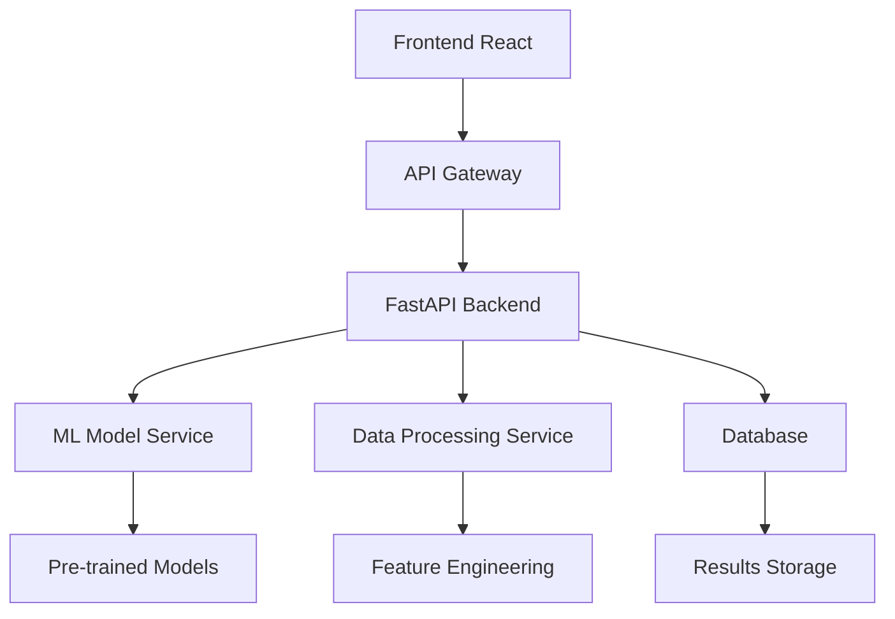

# Interfaz Web y Deployment - Sistema de Detección de Exoplanetas

## 🌐 Arquitectura de la Interfaz Web

### Componentes del Sistema Web



### Stack Tecnológico Completo

#### Frontend
- **React 18+**: Framework principal de UI
- **TypeScript**: Tipado estático para mejor desarrollo
- **Material-UI / Ant Design**: Componentes UI profesionales
- **Chart.js / D3.js**: Visualizaciones de datos
- **Axios**: Cliente HTTP para API calls
- **React Query**: Gestión de estado servidor

#### Backend
- **FastAPI**: Framework API moderno y rápido
- **Pydantic**: Validación de datos y serialización
- **SQLAlchemy**: ORM para base de datos
- **Celery**: Procesamiento asíncrono de tareas
- **Redis**: Cache y message broker

#### ML & Data Processing
- **scikit-learn**: Modelos de machine learning
- **joblib**: Serialización de modelos
- **pandas/numpy**: Procesamiento de datos
- **TSFRESH**: Feature extraction para series temporales

## 🎨 Diseño de la Interfaz de Usuario

### Página Principal - Dashboard

```tsx
// components/Dashboard.tsx
import React from 'react';
import { Card, Grid, Typography, Button } from '@mui/material';
import { Upload, Analytics, History } from '@mui/icons-material';

const Dashboard: React.FC = () => {
  return (
    <div className="dashboard-container">
      <Typography variant="h3" component="h1" gutterBottom>
        Detección de Exoplanetas con IA
      </Typography>
      
      <Grid container spacing={4}>
        {/* Upload Section */}
        <Grid item xs={12} md={4}>
          <Card className="dashboard-card">
            <Upload className="card-icon" />
            <Typography variant="h5">Cargar Datos</Typography>
            <Typography variant="body2">
              Sube archivos CSV con datos de candidatos a exoplanetas
            </Typography>
            <Button variant="contained" color="primary">
              Cargar Archivo
            </Button>
          </Card>
        </Grid>
        
        {/* Analysis Section */}
        <Grid item xs={12} md={4}>
          <Card className="dashboard-card">
            <Analytics className="card-icon" />
            <Typography variant="h5">Análisis Individual</Typography>
            <Typography variant="body2">
              Introduce parámetros manualmente para análisis individual
            </Typography>
            <Button variant="contained" color="secondary">
              Nuevo Análisis
            </Button>
          </Card>
        </Grid>
        
        {/* History Section */}
        <Grid item xs={12} md={4}>
          <Card className="dashboard-card">
            <History className="card-icon" />
            <Typography variant="h5">Historial</Typography>
            <Typography variant="body2">
              Revisa análisis anteriores y exporta resultados
            </Typography>
            <Button variant="outlined">
              Ver Historial
            </Button>
          </Card>
        </Grid>
      </Grid>
      
      {/* Quick Stats */}
      <ModelPerformanceStats />
    </div>
  );
};
```

### Formulario de Análisis Individual

```tsx
// components/ExoplanetAnalysisForm.tsx
import React, { useState } from 'react';
import { 
  TextField, 
  Button, 
  Grid, 
  Paper, 
  Typography,
  CircularProgress 
} from '@mui/material';

interface ExoplanetData {
  period: number;        // Período orbital (días)
  radius: number;        // Radio planetario (radios terrestres)
  temp: number;          // Temperatura de equilibrio (K)
  starRadius: number;    // Radio estelar (radios solares)
  starMass: number;      // Masa estelar (masas solares)
  starTemp: number;      // Temperatura estelar (K)
  depth: number;         // Profundidad del tránsito (ppm)
  duration: number;      // Duración del tránsito (hrs)
  snr: number;          // Signal-to-noise ratio
}

const ExoplanetAnalysisForm: React.FC = () => {
  const [formData, setFormData] = useState<ExoplanetData>({
    period: 0,
    radius: 0,
    temp: 0,
    starRadius: 0,
    starMass: 0,
    starTemp: 0,
    depth: 0,
    duration: 0,
    snr: 0
  });
  
  const [loading, setLoading] = useState(false);
  const [result, setResult] = useState<any>(null);

  const handleSubmit = async (e: React.FormEvent) => {
    e.preventDefault();
    setLoading(true);
    
    try {
      const response = await fetch('/api/predict', {
        method: 'POST',
        headers: { 'Content-Type': 'application/json' },
        body: JSON.stringify({ features: formData })
      });
      
      const prediction = await response.json();
      setResult(prediction);
    } catch (error) {
      console.error('Error en predicción:', error);
    } finally {
      setLoading(false);
    }
  };

  return (
    <Paper className="analysis-form" elevation={3}>
      <Typography variant="h4" gutterBottom>
        Análisis Individual de Candidato
      </Typography>
      
      <form onSubmit={handleSubmit}>
        <Grid container spacing={3}>
          {/* Parámetros Planetarios */}
          <Grid item xs={12}>
            <Typography variant="h6" color="primary">
              Parámetros Planetarios
            </Typography>
          </Grid>
          
          <Grid item xs={12} sm={6}>
            <TextField
              fullWidth
              label="Período Orbital (días)"
              type="number"
              value={formData.period}
              onChange={(e) => setFormData({...formData, period: +e.target.value})}
              helperText="Tiempo que tarda el planeta en completar una órbita"
            />
          </Grid>
          
          <Grid item xs={12} sm={6}>
            <TextField
              fullWidth
              label="Radio Planetario (R⊕)"
              type="number"
              value={formData.radius}
              onChange={(e) => setFormData({...formData, radius: +e.target.value})}
              helperText="Radio en términos de radios terrestres"
            />
          </Grid>
          
          {/* Parámetros Estelares */}
          <Grid item xs={12}>
            <Typography variant="h6" color="primary">
              Parámetros Estelares
            </Typography>
          </Grid>
          
          <Grid item xs={12} sm={6}>
            <TextField
              fullWidth
              label="Radio Estelar (R☉)"
              type="number"
              value={formData.starRadius}
              onChange={(e) => setFormData({...formData, starRadius: +e.target.value})}
              helperText="Radio en términos de radios solares"
            />
          </Grid>
          
          <Grid item xs={12} sm={6}>
            <TextField
              fullWidth
              label="Temperatura Estelar (K)"
              type="number"
              value={formData.starTemp}
              onChange={(e) => setFormData({...formData, starTemp: +e.target.value})}
              helperText="Temperatura efectiva de la estrella"
            />
          </Grid>
          
          {/* Métricas de Tránsito */}
          <Grid item xs={12}>
            <Typography variant="h6" color="primary">
              Métricas de Tránsito
            </Typography>
          </Grid>
          
          <Grid item xs={12} sm={4}>
            <TextField
              fullWidth
              label="Profundidad (ppm)"
              type="number"
              value={formData.depth}
              onChange={(e) => setFormData({...formData, depth: +e.target.value})}
              helperText="Profundidad del tránsito en partes por millón"
            />
          </Grid>
          
          <Grid item xs={12} sm={4}>
            <TextField
              fullWidth
              label="Duración (hrs)"
              type="number"
              value={formData.duration}
              onChange={(e) => setFormData({...formData, duration: +e.target.value})}
              helperText="Duración del tránsito en horas"
            />
          </Grid>
          
          <Grid item xs={12} sm={4}>
            <TextField
              fullWidth
              label="SNR"
              type="number"
              value={formData.snr}
              onChange={(e) => setFormData({...formData, snr: +e.target.value})}
              helperText="Signal-to-noise ratio"
            />
          </Grid>
          
          {/* Botón de Submit */}
          <Grid item xs={12}>
            <Button
              type="submit"
              variant="contained"
              size="large"
              disabled={loading}
              startIcon={loading ? <CircularProgress size={20} /> : null}
            >
              {loading ? 'Analizando...' : 'Analizar Candidato'}
            </Button>
          </Grid>
        </Grid>
      </form>
      
      {/* Mostrar Resultados */}
      {result && <PredictionResults result={result} />}
    </Paper>
  );
};
```

### Componente de Resultados

```tsx
// components/PredictionResults.tsx
import React from 'react';
import { 
  Card, 
  Typography, 
  Chip, 
  LinearProgress,
  Grid,
  Box
} from '@mui/material';
import { CheckCircle, Warning, Error } from '@mui/icons-material';

interface PredictionResultsProps {
  result: {
    prediction: string;
    confidence: number;
    probabilities: {
      CONFIRMED: number;
      FALSE_POSITIVE: number;
    };
  };
}

const PredictionResults: React.FC<PredictionResultsProps> = ({ result }) => {
  const getResultIcon = () => {
    if (result.prediction === 'CONFIRMED' && result.confidence > 0.8) {
      return <CheckCircle color="success" />;
    } else if (result.confidence > 0.6) {
      return <Warning color="warning" />;
    } else {
      return <Error color="error" />;
    }
  };

  const getResultColor = () => {
    if (result.prediction === 'CONFIRMED') {
      return result.confidence > 0.8 ? 'success' : 'warning';
    } else {
      return 'default';
    }
  };

  return (
    <Card className="prediction-results" elevation={2}>
      <Typography variant="h5" gutterBottom>
        Resultados del Análisis
      </Typography>
      
      <Box display="flex" alignItems="center" mb={2}>
        {getResultIcon()}
        <Chip 
          label={result.prediction === 'CONFIRMED' ? 'EXOPLANETA CONFIRMADO' : 'FALSO POSITIVO'}
          color={getResultColor()}
          size="large"
          style={{ marginLeft: 8 }}
        />
      </Box>
      
      <Grid container spacing={2}>
        <Grid item xs={12} sm={6}>
          <Typography variant="body1" gutterBottom>
            Confianza del Modelo: {(result.confidence * 100).toFixed(1)}%
          </Typography>
          <LinearProgress 
            variant="determinate" 
            value={result.confidence * 100}
            color={result.confidence > 0.8 ? 'success' : result.confidence > 0.6 ? 'warning' : 'error'}
          />
        </Grid>
        
        <Grid item xs={12} sm={6}>
          <Typography variant="body2" gutterBottom>
            Probabilidades:
          </Typography>
          <Typography variant="body2">
            Exoplaneta: {(result.probabilities.CONFIRMED * 100).toFixed(1)}%
          </Typography>
          <Typography variant="body2">
            Falso Positivo: {(result.probabilities.FALSE_POSITIVE * 100).toFixed(1)}%
          </Typography>
        </Grid>
      </Grid>
      
      {/* Interpretación */}
      <Box mt={2} p={2} bgcolor="background.paper" borderRadius={1}>
        <Typography variant="h6" gutterBottom>
          Interpretación
        </Typography>
        <Typography variant="body2">
          {result.prediction === 'CONFIRMED' 
            ? `Este candidato tiene una alta probabilidad de ser un exoplaneta real. Se recomienda seguimiento observacional para confirmación definitiva.`
            : `Este candidato probablemente es un falso positivo. La señal puede deberse a eclipses binarios, ruido instrumental, o contaminación de fuentes cercanas.`
          }
        </Typography>
      </Box>
    </Card>
  );
};
```

## 🔧 Backend API con FastAPI

### Estructura del API

```python
# main.py
from fastapi import FastAPI, File, UploadFile, HTTPException
from fastapi.middleware.cors import CORSMiddleware
from pydantic import BaseModel
import joblib
import pandas as pd
import numpy as np
from typing import Dict, List
import io

app = FastAPI(
    title="Exoplanet Detection API",
    description="API para detección de exoplanetas usando ensemble ML",
    version="1.0.0"
)

# CORS middleware
app.add_middleware(
    CORSMiddleware,
    allow_origins=["http://localhost:3000"],  # Frontend URL
    allow_credentials=True,
    allow_methods=["*"],
    allow_headers=["*"],
)

# Cargar modelo pre-entrenado
model = joblib.load('models/best_ensemble_model.pkl')
preprocessor = joblib.load('models/preprocessor.pkl')
feature_names = joblib.load('models/feature_names.pkl')

# Modelos de datos
class ExoplanetFeatures(BaseModel):
    period: float
    radius: float
    temp: float
    starRadius: float
    starMass: float
    starTemp: float
    depth: float
    duration: float
    snr: float

class PredictionResponse(BaseModel):
    prediction: str
    confidence: float
    probabilities: Dict[str, float]
    feature_importance: Dict[str, float]

class BatchPredictionResponse(BaseModel):
    total_processed: int
    confirmed_planets: int
    candidates: int
    false_positives: int
    results: List[Dict]
```

### Endpoints Principales

```python
@app.post("/api/predict", response_model=PredictionResponse)
async def predict_single(features: ExoplanetFeatures):
    """Predicción individual de exoplaneta"""
    try:
        # Convertir a DataFrame
        feature_dict = features.dict()
        df = pd.DataFrame([feature_dict])
        
        # Aplicar feature engineering
        df_engineered = apply_feature_engineering(df)
        
        # Preprocesar
        X = preprocessor.transform(df_engineered)
        
        # Predicción
        prediction = model.predict(X)[0]
        probabilities = model.predict_proba(X)[0]
        
        # Feature importance (si el modelo lo soporta)
        try:
            importance = get_feature_importance(model, feature_dict)
        except:
            importance = {}
        
        return PredictionResponse(
            prediction="CONFIRMED" if prediction == 1 else "FALSE_POSITIVE",
            confidence=max(probabilities),
            probabilities={
                "CONFIRMED": float(probabilities[1]), 
                "FALSE_POSITIVE": float(probabilities[0])
            },
            feature_importance=importance
        )
        
    except Exception as e:
        raise HTTPException(status_code=400, detail=f"Error en predicción: {str(e)}")

@app.post("/api/batch-predict")
async def batch_predict(file: UploadFile = File(...)):
    """Predicción en lote desde archivo CSV"""
    try:
        # Leer archivo CSV
        contents = await file.read()
        df = pd.read_csv(io.StringIO(contents.decode('utf-8')))
        
        # Validar columnas requeridas
        required_columns = ['period', 'radius', 'temp', 'starRadius', 'starMass', 
                          'starTemp', 'depth', 'duration', 'snr']
        missing_columns = set(required_columns) - set(df.columns)
        if missing_columns:
            raise HTTPException(
                status_code=400, 
                detail=f"Columnas faltantes: {missing_columns}"
            )
        
        # Aplicar feature engineering
        df_engineered = apply_feature_engineering(df)
        
        # Preprocesar
        X = preprocessor.transform(df_engineered)
        
        # Predicciones
        predictions = model.predict(X)
        probabilities = model.predict_proba(X)
        
        # Compilar resultados
        results = []
        for i, (pred, prob) in enumerate(zip(predictions, probabilities)):
            result = {
                'index': i,
                'prediction': "CONFIRMED" if pred == 1 else "FALSE_POSITIVE",
                'confidence': float(max(prob)),
                'prob_confirmed': float(prob[1]),
                'prob_false_positive': float(prob[0])
            }
            results.append(result)
        
        # Estadísticas
        confirmed_count = sum(1 for r in results if r['prediction'] == 'CONFIRMED')
        
        return BatchPredictionResponse(
            total_processed=len(results),
            confirmed_planets=confirmed_count,
            candidates=0,  # Podría implementarse lógica para candidatos
            false_positives=len(results) - confirmed_count,
            results=results
        )
        
    except Exception as e:
        raise HTTPException(status_code=400, detail=f"Error en procesamiento: {str(e)}")

@app.get("/api/model-info")
async def get_model_info():
    """Información del modelo"""
    return {
        "model_type": "Ensemble (Stacking)",
        "base_models": ["Random Forest", "AdaBoost", "Extra Trees", "LightGBM"],
        "training_accuracy": 0.8308,
        "features_used": len(feature_names),
        "last_updated": "2025-01-01"
    }

def apply_feature_engineering(df):
    """Aplicar feature engineering"""
    df_eng = df.copy()
    
    # Características derivadas
    df_eng['planet_star_radius_ratio'] = df['radius'] / df['starRadius']
    df_eng['equilibrium_temp_ratio'] = df['temp'] / df['starTemp'] 
    df_eng['transit_depth_expected'] = (df['radius'] / df['starRadius']) ** 2 * 1e6
    
    # Características orbitales (aproximadas)
    df_eng['orbital_velocity'] = 2 * np.pi / df['period']  # Simplificado
    
    return df_eng

def get_feature_importance(model, features):
    """Obtener importancia de características"""
    if hasattr(model, 'feature_importances_'):
        importance = model.feature_importances_
        return dict(zip(feature_names, importance))
    elif hasattr(model, 'coef_'):
        importance = np.abs(model.coef_[0])
        return dict(zip(feature_names, importance))
    else:
        return {}
```

### WebSocket para Procesamiento en Tiempo Real

```python
from fastapi import WebSocket
import asyncio
import json

@app.websocket("/ws/batch-progress")
async def websocket_batch_progress(websocket: WebSocket):
    """WebSocket para progreso de procesamiento en lote"""
    await websocket.accept()
    
    try:
        while True:
            # Recibir archivo o datos
            data = await websocket.receive_text()
            request_data = json.loads(data)
            
            # Simular procesamiento con actualizaciones de progreso
            total_items = request_data.get('total', 100)
            
            for i in range(total_items):
                # Simular procesamiento
                await asyncio.sleep(0.1)
                
                progress = {
                    'progress': (i + 1) / total_items * 100,
                    'processed': i + 1,
                    'total': total_items,
                    'current_item': f"Procesando objeto {i + 1}"
                }
                
                await websocket.send_text(json.dumps(progress))
            
            # Enviar resultado final
            final_result = {
                'status': 'completed',
                'summary': {
                    'total_processed': total_items,
                    'confirmed_planets': np.random.randint(10, 30),
                    'false_positives': total_items - np.random.randint(10, 30)
                }
            }
            
            await websocket.send_text(json.dumps(final_result))
            
    except Exception as e:
        await websocket.send_text(json.dumps({
            'status': 'error',
            'message': str(e)
        }))
    finally:
        await websocket.close()
```

## 📊 Componentes de Visualización

### Métricas del Modelo en Tiempo Real

```tsx
// components/ModelMetrics.tsx
import React, { useEffect, useState } from 'react';
import { Line, Doughnut } from 'react-chartjs-2';
import { Card, Grid, Typography } from '@mui/material';

const ModelMetrics: React.FC = () => {
  const [metrics, setMetrics] = useState(null);
  
  useEffect(() => {
    fetch('/api/model-info')
      .then(res => res.json())
      .then(data => setMetrics(data));
  }, []);
  
  const performanceData = {
    labels: ['Accuracy', 'Precision', 'Recall', 'F1-Score'],
    datasets: [{
      data: [83.08, 82.5, 81.2, 81.8],
      backgroundColor: ['#FF6384', '#36A2EB', '#FFCE56', '#4BC0C0']
    }]
  };
  
  return (
    <Grid container spacing={3}>
      <Grid item xs={12} md={6}>
        <Card className="metrics-card">
          <Typography variant="h6">Rendimiento del Modelo</Typography>
          <Doughnut data={performanceData} />
        </Card>
      </Grid>
      
      <Grid item xs={12} md={6}>
        <Card className="metrics-card">
          <Typography variant="h6">Estadísticas de Uso</Typography>
          {/* Implementar gráfico de uso temporal */}
        </Card>
      </Grid>
    </Grid>
  );
};
```

### Visualización de Curvas de Luz

```tsx
// components/LightCurveVisualization.tsx
import React from 'react';
import { Line } from 'react-chartjs-2';
import { Card, Typography } from '@mui/material';

interface LightCurveProps {
  timeData: number[];
  fluxData: number[];
  transitMarkers?: number[];
}

const LightCurveVisualization: React.FC<LightCurveProps> = ({
  timeData, 
  fluxData, 
  transitMarkers 
}) => {
  const chartData = {
    labels: timeData,
    datasets: [
      {
        label: 'Flujo Normalizado',
        data: fluxData,
        borderColor: 'rgb(75, 192, 192)',
        backgroundColor: 'rgba(75, 192, 192, 0.2)',
        tension: 0.1
      }
    ]
  };
  
  const options = {
    responsive: true,
    scales: {
      x: {
        title: {
          display: true,
          text: 'Tiempo (días)'
        }
      },
      y: {
        title: {
          display: true,
          text: 'Flujo Relativo'
        }
      }
    },
    plugins: {
      title: {
        display: true,
        text: 'Curva de Luz - Detección de Tránsito'
      }
    }
  };
  
  return (
    <Card className="lightcurve-card">
      <Typography variant="h6" gutterBottom>
        Análisis de Curva de Luz
      </Typography>
      <Line data={chartData} options={options} />
    </Card>
  );
};
```

## 🚀 Deployment y DevOps

### Docker Configuration

```dockerfile
# Dockerfile para el backend
FROM python:3.9-slim

WORKDIR /app

# Instalar dependencias del sistema
RUN apt-get update && apt-get install -y \
    gcc \
    && rm -rf /var/lib/apt/lists/*

# Copiar requirements
COPY requirements.txt .
RUN pip install --no-cache-dir -r requirements.txt

# Copiar código
COPY . .

# Exponer puerto
EXPOSE 8000

# Comando de inicio
CMD ["uvicorn", "main:app", "--host", "0.0.0.0", "--port", "8000"]
```

```dockerfile
# Dockerfile para el frontend
FROM node:16-alpine

WORKDIR /app

# Copiar package files
COPY package*.json ./
RUN npm install

# Copiar código fuente
COPY . .

# Build de producción  
RUN npm run build

# Servir con nginx
FROM nginx:alpine
COPY --from=0 /app/build /usr/share/nginx/html
COPY nginx.conf /etc/nginx/nginx.conf

EXPOSE 80
CMD ["nginx", "-g", "daemon off;"]
```

### Docker Compose para Development

```yaml
# docker-compose.dev.yml
version: '3.8'

services:
  backend:
    build: 
      context: ./backend
      dockerfile: Dockerfile.dev
    ports:
      - "8000:8000"
    volumes:
      - ./backend:/app
      - ./models:/app/models
    environment:
      - ENVIRONMENT=development
      - DEBUG=true
    depends_on:
      - redis
      - postgres

  frontend:
    build:
      context: ./frontend
      dockerfile: Dockerfile.dev
    ports:
      - "3000:3000"
    volumes:
      - ./frontend:/app
      - /app/node_modules
    environment:
      - REACT_APP_API_URL=http://localhost:8000

  redis:
    image: redis:alpine
    ports:
      - "6379:6379"

  postgres:
    image: postgres:13
    environment:
      POSTGRES_DB: exoplanets
      POSTGRES_USER: admin
      POSTGRES_PASSWORD: password
    ports:
      - "5432:5432"
    volumes:
      - postgres_data:/var/lib/postgresql/data

  nginx:
    image: nginx:alpine
    ports:
      - "80:80"
    volumes:
      - ./nginx/nginx.conf:/etc/nginx/nginx.conf
    depends_on:
      - frontend
      - backend

volumes:
  postgres_data:
```

### CI/CD con GitHub Actions

```yaml
# .github/workflows/deploy.yml
name: Deploy Exoplanet Detection System

on:
  push:
    branches: [ main ]
  pull_request:
    branches: [ main ]

jobs:
  test:
    runs-on: ubuntu-latest
    
    steps:
    - uses: actions/checkout@v2
    
    - name: Set up Python
      uses: actions/setup-python@v2
      with:
        python-version: 3.9
    
    - name: Install dependencies
      run: |
        pip install -r backend/requirements.txt
        pip install pytest pytest-cov
    
    - name: Run tests
      run: |
        cd backend
        pytest tests/ --cov=. --cov-report=xml
    
    - name: Upload coverage
      uses: codecov/codecov-action@v1

  build-and-deploy:
    needs: test
    runs-on: ubuntu-latest
    if: github.ref == 'refs/heads/main'
    
    steps:
    - uses: actions/checkout@v2
    
    - name: Build Docker images
      run: |
        docker build -t exoplanet-backend ./backend
        docker build -t exoplanet-frontend ./frontend
    
    - name: Deploy to production
      run: |
        # Comandos de deployment específicos del proveedor
        echo "Deploying to production..."
```

### Monitoreo y Logging

```python
# monitoring.py
import logging
from datetime import datetime
import json
from fastapi import Request
import time

# Configurar logging
logging.basicConfig(
    level=logging.INFO,
    format='%(asctime)s - %(name)s - %(levelname)s - %(message)s',
    handlers=[
        logging.FileHandler('logs/exoplanet_api.log'),
        logging.StreamHandler()
    ]
)

logger = logging.getLogger(__name__)

class APIMonitoring:
    def __init__(self):
        self.request_count = 0
        self.prediction_count = 0
        self.error_count = 0
    
    async def log_request(self, request: Request, call_next):
        """Middleware para logging de requests"""
        start_time = time.time()
        
        # Log request
        logger.info(f"Request: {request.method} {request.url}")
        
        # Process request
        response = await call_next(request)
        
        # Log response
        process_time = time.time() - start_time
        logger.info(f"Response: {response.status_code} - {process_time:.3f}s")
        
        # Update metrics
        self.request_count += 1
        if request.url.path.startswith('/api/predict'):
            self.prediction_count += 1
        if response.status_code >= 400:
            self.error_count += 1
        
        return response
    
    def get_metrics(self):
        """Obtener métricas de monitoreo"""
        return {
            'total_requests': self.request_count,
            'predictions_made': self.prediction_count,
            'error_count': self.error_count,
            'uptime': datetime.now().isoformat()
        }

# Integrar en FastAPI
monitoring = APIMonitoring()

@app.middleware("http")
async def add_monitoring(request: Request, call_next):
    return await monitoring.log_request(request, call_next)

@app.get("/api/health")
async def health_check():
    """Health check endpoint"""
    return {
        'status': 'healthy',
        'timestamp': datetime.now().isoformat(),
        'metrics': monitoring.get_metrics()
    }
```

---

**Anterior**: [Métricas y Evaluación](./metrics-evaluation.md) | **Siguiente**: [Referencias y Recursos](./references-resources.md)